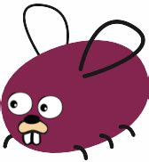

# gohost
   
Gohost is a library that wraps [Cohost's](https://cohost.org/) public API!
# Current Features
- Can start a user session given an email and password, or a cookie
- Can retrieve posts from your projects
- Can post and edit posts on editable projects
- Can use the requests package to make custom requests to Cohost API endpoints
# Installation
`go get github.com/curtywill/gohost`
# Getting Started
Before anything can be done with Gohost, you need an authenticated user. This can be done with a cookie:      
`user, err := gohost.LoginWithCookie(nil, "your_cookie")`   
or with an email and password:   
`user, err := gohost.LoginWithPass(nil, "email", "password")`   
(Note: passing nil to these functions means http.DefaultClient will be used for all requests, send a custom client if that's unsatisfactory)   
For more on what to do next, check out the [example](https://github.com/curtywill/gohost/blob/main/_examples/example.go).
# Cohost Terminology
- Project: page that a user can edit   
- Blocks: the blocks of attachments and text that make up posts. Get representations of these using the AttachmentBlock and MarkdownBlock functions.
# Upcoming Features
- View a post's share tree
- View comments on posts
- More support for drafts
- More stuff that hasn't crossed my mind yet
# Thanks
- [cohost.py](https://github.com/valknight/Cohost.py): HUGE shoutout to Valknight for giving me a great example to follow in building this
- [cohost.js](https://github.com/mogery/cohost.js/): obligatory thank you by the transitive property
- [Go](https://github.com/golang/go): had to dig through the Go source to figure out multipart forms and the mime package, most readable source for a language I've ever seen